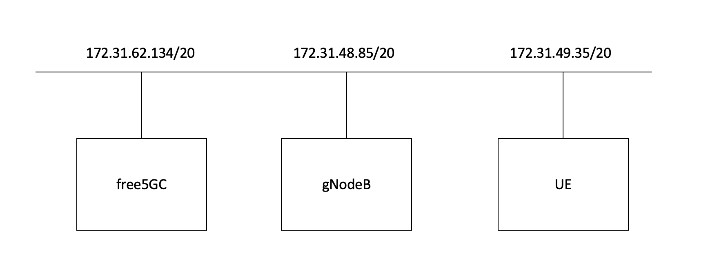

# How to run master branch free5GC on Ubuntu-22.04



## Install master branch of free5GC

Here is [github](https://github.com/free5gc/free5gc) and [installation guide](https://github.com/free5gc/free5gc/wiki/Installation) of free5GC.

### Prepare necessary packages

All of C code is gone. No need of gcc and supporting library.

``` shell
sudo apt update
sudo apt upgrade -y
sudo apt install -y git wget golang-go make
```

### clone and build free5GC

``` shell
git clone --recursive -j `nproc` https://github.com/free5gc/free5gc.git
cd free5gc
git checkout main
git submodule sync
git submodule update --init --jobs `nproc`
git submodule foreach git checkout main
git submodule foreach git pull --jobs `nproc`

```

Now we are ready, just simply make.

``` shell
make
```

### configuration

``` shell
cd free5gc
mv config config.orig
ln -s ~/free5gc-sample/config .
mv run.sh run.sh.orig
ln -s ~/free5gc-sample/run.sh .
mv force_kill.sh force_kill.sh.orig
ln -s ~/free5gc-sample/force_kill.sh .
```

## Install webconsole

webconsole is UI for free5GC. it uses nodejs, so `node` and `yarn` must be
installed beforehand. We recommend to use `volta` for package manager for
nodejs.

https://volta.sh/

``` shell
curl https://get.volta.sh | bash
logout
login
volta install node
volta install yarn
```

build webconsole

``` shell
cd free5gc/webconsole/frontend
yarn install
cd ..
go build
```

## Install mongodb

We need to install `mongodb` manually on Ubuntu 22.04.

Here is a [description](https://dba.stackexchange.com/questions/323069/how-to-install-mongodb-3-6-on-ubuntu-22-04) about it.  Download following package.

https://fastdl.mongodb.org/linux/mongodb-linux-x86_64-ubuntu1804-3.6.22.tgz

then

``` shell
tar xvzf mongodb-linux-x86_64-ubuntu1804-3.6.22.tgz
cd mongodb-linux-x86_64-ubuntu1804-3.6.22/bin
sudo mv * /usr/local/bin
sudo mkdir -p /data/db
sudo chown -r ubuntu /data
```

## Install gtp5g

gtp5g is kernel module for GTP.  Here is [github](https://github.com/free5gc/gtp5g) of gtp5g.

``` shell
git clone https://github.com/free5gc/gtp5g.git
cd gtp5g
make
sudo make install
```

## install UERANSIM

Here is [github](https://github.com/aligungr/UERANSIM) of UERANSIM.

``` shell
sudo apt install -y make gcc g++ libsctp-dev lksctp-tools iproute2
sudo snap install cmake --classic

git clone git@github.com:aligungr/UERANSIM.git
cd UERANSIM
make
```

### configuration

``` shell
mv config config.bak
ln -s ~/free5gc-sample/ueransim ./config
```
